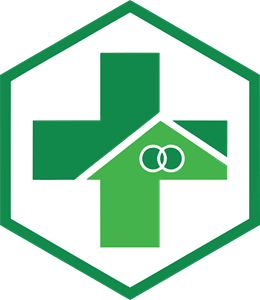

<p align="center">
  
</p>

<h1 align="center">🏥 Rmedis - Sistem Informasi Rekam Medis</h1>

<p align="center">
  Aplikasi rekam medis modern berbasis web yang dirancang untuk menyederhanakan manajemen data pasien di fasilitas kesehatan. Dibangun dengan Laravel, Filament, dan Livewire.
</p>

<p align="center">
  <a href="https://laravel.com"></a>
  <a href="https://filamentphp.com"></a>
  <a href="https://php.net"></a>
  <a href="LICENSE"></a>
</p>

---

## 📋 Daftar Isi

- [Fitur Utama](#-fitur-utama)
- [Tech Stack](#-tech-stack)
- [Instalasi](#-instalasi)
- [Penggunaan](#-penggunaan)
- [Struktur Proyek](#-struktur-proyek)
- [Kontribusi](#-kontribusi)
- [Lisensi](#-lisensi)
- [Kontak](#-kontak)

---

## ✨ Fitur Utama

- **Manajemen Akses**: Sistem multi-role (Admin, Dokter, Perawat, Staff) dengan kontrol akses berbasis peran (RBAC).
- **Manajemen Pasien**: Registrasi pasien dengan No. RM otomatis, riwayat kunjungan, dan pencarian data.
- **Pendaftaran & Jadwal**: Manajemen pendaftaran kunjungan dan jadwal praktik dokter.
- **Rekam Medis Elektronik**:
  - **Asesmen Keperawatan & Medis**: Format SOAP, TTV, diagnosis (ICD-X), dan rencana terapi.
  - **Form Khusus**: Odontogram interaktif untuk Poli Gigi dan formulir triase untuk IGD.
- **Catatan Perkembangan**: Lacak perkembangan kondisi pasien dengan SOAP notes.
- **Manajemen Poli**: Konfigurasi unit layanan dan penugasan dokter.
- **Laporan**: Cetak rekam medis ke PDF dan ekspor data pasien.

---

## 🛠 Tech Stack

| Kategori      | Teknologi                                                                                             |
|---------------|-------------------------------------------------------------------------------------------------------|
| **Backend**   | [Laravel 12](https://laravel.com), [PHP 8.2+](https://php.net), [MySQL](https://www.mysql.com)           |
| **Frontend**  | [Filament 3.3](https://filamentphp.com), [Livewire 3](https://livewire.laravel.com), [Tailwind CSS](https://tailwindcss.com), [Alpine.js](https://alpinejs.dev) |
| **Packages**  | `laravel-dompdf` (PDF), `filament-export` (Export), `laravel/breeze` (Auth), `livewire/volt` (Komponen) |
| **Dev Tools** | [Vite](https://vitejs.dev), [Laravel Pint](https://laravel.com/docs/pint), [PHPUnit](https://phpunit.de) |

---

## 🚀 Instalasi

### Prasyarat
- PHP >= 8.2
- Composer >= 2.0
- Node.js >= 18.x
- MySQL atau PostgreSQL

### Langkah-langkah
1.  **Clone repository:**
    ```bash
    git clone https://github.com/username/rmedis.git
    cd rmedis
    ```

2.  **Install dependencies:**
    ```bash
    composer install
    npm install
    ```

3.  **Setup environment:**
    ```bash
    # Salin file .env
    copy .env.example .env

    # Generate application key
    php artisan key:generate
    ```

4.  **Konfigurasi database** di file `.env` Anda.

5.  **Jalankan migrasi dan seeder:**
    ```bash
    php artisan migrate --seed
    ```

6.  **Buat user admin:**
    ```bash
    php artisan make:filament-user
    ```

7.  **Build assets & jalankan aplikasi:**
    ```bash
    # Jalankan server pengembangan (all-in-one)
    composer dev
    ```
    Aplikasi akan berjalan di `http://localhost:8000`.

---

## 📖 Penggunaan

- **URL Admin**: `http://localhost:8000/admin`
- **Login**: Gunakan kredensial yang Anda buat pada langkah instalasi.

**Workflow Umum:**
1.  **Staff** mendaftarkan pasien baru.
2.  **Staff** membuat jadwal kunjungan.
3.  **Dokter** mengisi rekam medis (asesmen keperawatan & medis).
4.  **Dokter** menambahkan catatan perkembangan jika diperlukan.
5.  **Dokter** mencetak laporan PDF.

---

## 🗂️ Struktur Proyek

```
/
├── app/                # Logika utama aplikasi (Model, Controller, Filament Resources)
├── config/             # File konfigurasi
├── database/           # Migrasi, seeder, dan factory
├── resources/
│   ├── css/            # File CSS
│   ├── js/             # File JavaScript
│   └── views/          # Blade templates dan komponen Livewire
├── routes/             # Definisi rute (web.php, auth.php)
├── public/             # Aset publik (gambar, CSS/JS hasil build)
└── tests/              # Unit dan Feature tests
```

---

## 🤝 Kontribusi

Kami sangat terbuka untuk kontribusi! Jika Anda ingin membantu, silakan:
1.  **Fork** repository ini.
2.  Buat **branch** baru (`git checkout -b feature/NamaFitur`).
3.  **Commit** perubahan Anda (`git commit -m 'Add: NamaFitur'`).
4.  **Push** ke branch (`git push origin feature/NamaFitur`).
5.  Buat **Pull Request**.

Pastikan kode Anda mengikuti standar dengan menjalankan:
```bash
./vendor/bin/pint
```

---

## 📝 Lisensi

Proyek ini dilisensikan di bawah [MIT License](LICENSE).

---

## 📧 Kontak

- **Developer**: Bayu Dani
- **Email**: bayu22122017@gmail.com
- **GitHub Issues**: [Buka Isu](https://github.com/username/rmedis/issues)

---

<p align="center">
Dibuat dengan ❤️ untuk manajemen layanan kesehatan yang lebih baik.
</p>